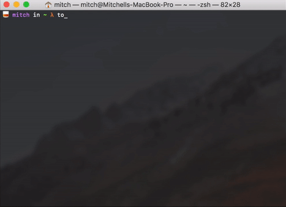

# Catacomb

> A minimalistic CLI tool for storing shell commands.

### Setup

Catacomb is available on PyPi, you can install it using pip.

`pip install catacomb`

### Usage

Use `tomb --help` for more information.
