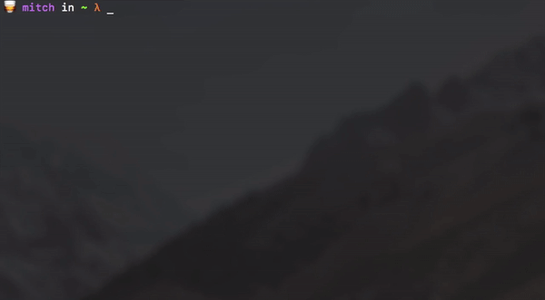

# catacomb

[](https://travis-ci.org/mitchjeitani/catacomb)
[](https://travis-ci.org/mitchjeitani/catacomb)

> A minimalistic CLI tool for storing shell commands.



Remembering useful commands is difficult, and typing out long commands is frustrating. Relieve these pain points with catacomb, a simple CLI tool for storing, retrieving and executing commands. Just type out the command once, and then execute it through catacomb, with an alias of your choice.

### Setup

```
$ pip3 install catacomb
```

### Usage

Two entry points are used to separate organisation of tombs and their contents. The `catacomb` entry point provides commands to deal with organisation of tombs within the catacomb. Having seperate tombs for seperate projects, as an example, would allow isolated environments - so that you're not forced to come up with new aliases that execute different commands for different projects.

```
Usage: catacomb [OPTIONS] COMMAND [ARGS]...

  For handling the tombs within your catacomb.

Options:
  -h, --help  Show this message and exit.

Commands:
  bury    Permanently buries a tomb, preventing any further use.
  create  Creates a new tomb in the catacomb.
  list    Lists the tombs currently available in the catacomb.
  open    Opens an existing tomb.
```

The `tomb` entry point provides commands to deal with the contents of a single tomb. Tombs act as a store for all your commands, allowing you to use and manage them by simply specifying the alias.

```
Usage: tomb [OPTIONS] COMMAND [ARGS]...

  For handling the contents within a tomb.

Options:
  -h, --help  Show this message and exit.

Commands:
  add     Stores a new command in the tomb.
  clean   Empties the contents of a tomb.
  list    Lists the commands currently stored in the tomb.
  rm      Removes a command from the tomb.
  status  Shows the current tombs status.
  use     Grabs a command from the tomb and executes it.
```

### Examples

Detailed usage has been documented for each command and can be viewed at the following directories:

* [Examples](examples/catacomb) for the `catacomb` entry point
* [Examples](examples/tomb) for the `tomb` entry point

### Contributing

This project is still in its infancy, so feel free to contribute by reporting issues or suggesting some new features. Pull requests are definitely welcomed!

Please be sure that any contributions follow [PEP8](https://www.python.org/dev/peps/pep-0008/) standards.
